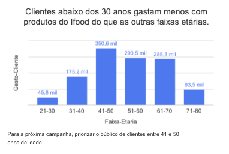
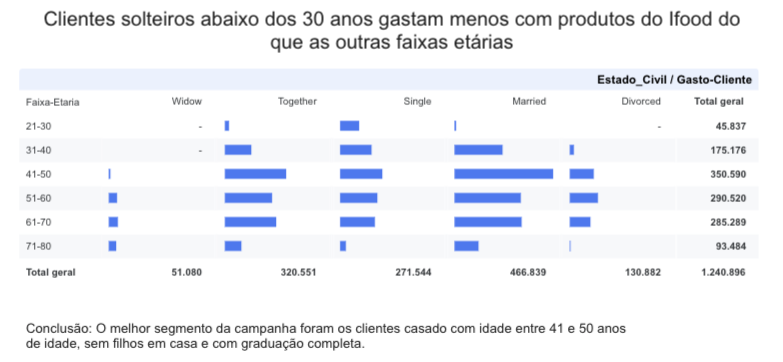
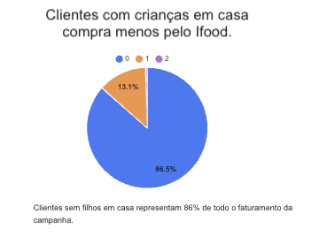
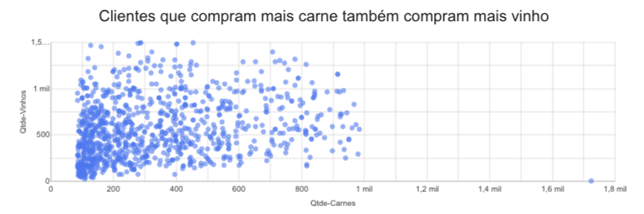

# Análise de campanha de Marketing do iFood

# Problema de negócio
iFood é o principal aplicativo de entrega de comida no Brasil, presente em mais de mil cidades. 

Manter um alto engajamento do cliente é fundamental para o crescimento e a consolidação da posição da empresa como líder de mercado. Analistas de dados que trabalham na equipe de dados são constantemente desafiados a fornecer insights e valor para a empresa por meio de projetos.

Este caso pretende simular isso. Neste caso, você é apresentado a um conjunto de dados de amostra sobre o cliente e as interações da campanha iFood com esse cliente. É seu desafio entender os dados, encontrar oportunidades e insights de negócios e propor qualquer ação orientada a dados para otimizar os resultados das campanhas e gerar valor para a empresa. 

Como analista de dados, o seu objetivo é:
Fazer uma análise descritiva dos clientes com base nos comportamentos, a fim de encontrar características que permitam à empresa maximizar o lucro da próxima campanha de marketing.

# Contexto
O time de Marketing do iFood faz campanhas recorrentes para aumentar o faturamento da empresa. Porém existe uma necessidade de entender as ações que trouxeram resultados positivos e negativos para aprender e replicar nas futuras campanhas com o objetivo de aumentar o faturamento.

Nesse contexto, o Analista de Dados tem um papel fundamental para coletar, analisar e gerar insights para o time de negócio, a fim de ajudá-lo a aumentar o faturamento nas próximas campanhas.

# Premissas de análise
1. A campanha analisada aconteceu entre 15 de janeiro de 2025 até 30 de janeiro de 2025.
2. Todos os produtos comprados com cupom foram removidos.
3. A análise considerou somente os produtos do catágolo da campanha.

# Estratégia da solução
O método Fato-Dimensão foi usado para desenvolver a análise de dados da campanha de Marketing.

## Passo 1: Resumir o contexto em uma pergunta aberta
As perguntas abertas são um tipo de demanda muito comum em análise de dados no qual a demanda possui N possíveis soluções e cabe ao Analista de Dados avaliar as possibilidades e escolher a alternativa com o maior retorno com o menor esforço possível. Para essa análise foi definida a seguinte pergunta aberta:

**Como aumentar o resultado da próxima campanha de Marketing?**

## Passo 2: Transformar a pergunta aberta em fechada
As perguntas fechadas são um tipo de demanda muito comum em análise de dados. Essa demanda contém todos os detalhes da análise de dados e direciona o analista exatamente para o que precisa ser feito. Geralmente, a pergunta fechada é a escolha de uma solução entre todas as alternativas possíveis, feita por um profissional mais Senior da área.

Para essa análise, foi definida a seguinte pergunta fechada:

**Quais são as características dos clientes que mais gastaram na campanha de MArketing?**

## Passo 3: Definição da coluna Fato
O Fato é a coluna de interesse que representa o ponto focal da análise. Nesse caso, a coluna "Gasto-Clientes" representa o faturamento de cada cliente dentro da campanha e será o objetivo da nossa análise, dado que o problema envolve aumento do faturamento na próxima campanha de Marketing.

## Passo 4: Identificação das Dimensões
As colunas foram agrupadas em dimensões comuns que fornecem mais detalhes sobre o Fato que será analisado. Foram organizadas as seguintes dimensões:

1. Cliente
  - Salário
  - Idade
  - Faixa-Etária
  - Estado-Civil
  - Formação
  - Crianças-Casa
  - Adolescentes-Casa
  - Recência

2. Produto
  - Qtde-Vinhos
  - Qtde-Frutas
  - Qtde-Carnes
  - Qtde-Peixes
  - Qtde-Doces
  - Qtde-Premium

3. Comportamento de Compra
  - Qtde-Compras
  - Qtde-Compras-Web
  - Qtde-Compras-Loja
  - Visitas-Site-Mes
4. Comportamento de Mkt
  - Reclamaçoes

## Passo 5: Hipóteses Analíticas
Fato(Medida) + Dimensão(Detalhes) + Comparação

As hipóteses analíticas são construídas a partir da combinação do Fato com as Dimensões, usando sempre um valor de comparação como maior, menor ou igual.

Fato + Dimensão: Cliente - Atributos: Idade.

1. O faturamento dos clientes abaixo de 30 anos é maior do que nas outras faixas etárias.
2. O faturamento dos clientes entre 20 e 30 anos é maior do que nas outras faixas etárias.
3. O faturamento dos clientes acima dis 30 anos do que nas outras faixas etárias.

Fato + Dimensão: Cliente - Atributos: Estado Civil.

4. Clientes solteiros gastam mais do que os outros segmentos de clientes.
5. Clientes solteiros gastam menos do que os outros segmentos de clientes.
6. Clientes casados gastam mais do que os outros segmentos de clientes.

Fato + Dimensão: Cliente - Atributos: Estado Civil + Idade.

7. Clientes solteiros acima dos 30 anos gastam mais do que clientes casados acima dos 30 anos.

Fato + Dimensão: Cliente - Atributos: Formação.

8. Clientes com formações avançadas (Doutorado) gastam mais do que clientes com Ensino Fundamental.
9. Clientes com maiores salários tem nível de escolaridade maior.

## Passo 6: Critérios de Priorização
Critério 1: Dados disponíveis
Critério 2: Insights Acionável

## Passo 7: Priorização das Hipóteses Analíticas
Hipótese 1. Clientes abaixo dos 30 anos gastam mais com produtos do iFood do que as outras faixas etárias.

Hipótese 2. Clientes solteiros gastam menos do que os outros segmentos de clientes.
[//]

Hipótese 3. Clientes solteiros abaixo dos 30 anos gastam mais com produtos do iFood do que as outras faixas etárias.

Hipótese 4. Clientes com crianças em casa compram mais pelo ifood.

Hipótese 5. Clientes que compram mais carne também compram mais vinho.

# Insights da análise

# Resultados

# Próximos Passos
